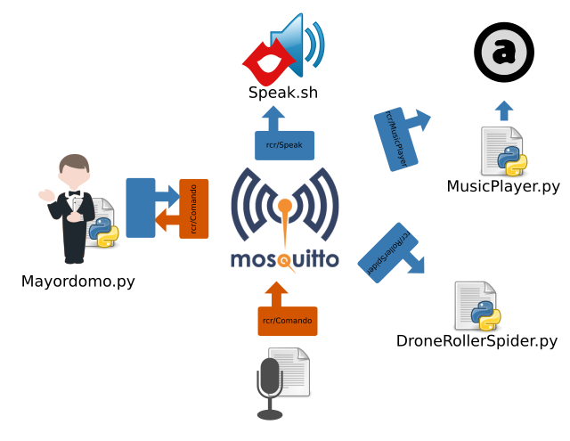

Mayordomo
=========

Entorno de microcontroladores/software conectados a través de MQTT y controlados a través de una aplicación desarrollada en Python (**Mayordomo.py**).

Adicionalmente se agrega una app en Android que convierte Voz a Texto y lo envía a Mayordomo a través de MQTT, simplificando así el interactuar con todo el entorno.

Las componentes principales corresponden a:

- **Mayordomo.py**: punto central de recepción de comandos utilizando el tópico `rcr/Comando` y así interactuar con el entorno:
    - `marí`: nombre del mayordomo; responde que una frase de texto audible
    - `que hora es`: responde de manera audible con la hora actual
    - `toca música`: inicia la reproducción del tema musical acual en el reproductor de música; interactua con MusicPlayer.py
    - `deten música`: detiene la reproducción del tema musical acual en el reproductor de música; interactua con MusicPlayer.py
    - `pausar música`: pausa la reproducción del tema musical acual en el reproductor de música; interactua con MusicPlayer.py
    - `tema siguiente`: avanza al siguiente tema en el reproductor de música; interactua con MusicPlayer.py
    - `tema anterior`: retrocede al tema anterior en el reproductor de música; interactua con MusicPlayer.py
    - `conecta spider`: inicia una conexión con el drone Roller Spider; interactua con DroneRollerSpider.py
    - `desconecta spider`: se desconecta del drone Roller Spider; interactua con DroneRollerSpider.py
    - `subir spider`: eleva el drone Roller Spider; interactua con DroneRollerSpider.py
    - `bajar spider`: aterriza el drone Roller Spider; interactua con DroneRollerSpider.py

- **VoiceAndMQTT**: app para Android que convierte Voz a Texto y lo envía al tópico utilizado por Mayordomo; el sentido es que éstos mensajes correspondan a las ordenes a ejecutar

Las componentes del entorno controladas por Mayormodo corresponden a las siguientes:

- **Speak.sh**: script shell que recibe texto en el tópico `rcr/Speak` y lo envía al sistema de audio del equipo

- **MusicPlayer.py**: script python que recibe comandos via MQTT y los envia a Audacious (via DBUS) permitiendo así controlar el reproductor de música. Recibe comandos en el tópico `rcr/MusicPlayer`:
    -  `play`: reproduce el tema actual
    -  `pause`: pausa el tema actual
    -  `stop`: detiene el tema actual
    -  `next`: avanza al siguiente tema
    -  `previous`: retrocede al tema anterior
    -  `songtitle`: verbaliza datos del tema actual

- **DroneRollerSpider.py**: script python para controlar un drone RollerSpider de Parrot via Bluetooth. Recibe comandos en el tópico `rcr/RollerSpider`:
    - `connect`: inica conexión con el drone
    - `disconnect`:se desconecta del drone
    - `takeoff`: eleva el drone
    - `land`: aterriza el drone

Pendientes por desarrollar:
- Control remoto de TV vía Voz: NodeMCU con emisor IR que recibe comando desde Mayordomo a través de MQTT para control la TV

Palabras: mqtt, mosquitto, NodeMCU, Arduino, Android, Jackd, DBUS, Audacious, drone, Parrot

## Preparación demo a presentar en feria Santiago Centro
1. Desactivar FireWall
        Depende del software utilizado. En mi caso Gufw y su interfaz gráfica
2. Activar Mosquitto
        $ systemctl start mosquitto.service
3. Conectar PulseAudio a Jackd
        $ pacmd load-module module-jack-sink
        $ pacmd set-default-sink jack_out
4. Levantar el entorno
    - `Jackd`
    - `Audacious` (cargar una lista de temas)
    - `Speak.sh`, para los mensajes de texto a través del parlante
    - `MusicPlayer.py`, para controlar vía DBUS a Audacious
    - `DroneRollerSpider.py`, para controlar el drone
    - `Mayordomo.py`
